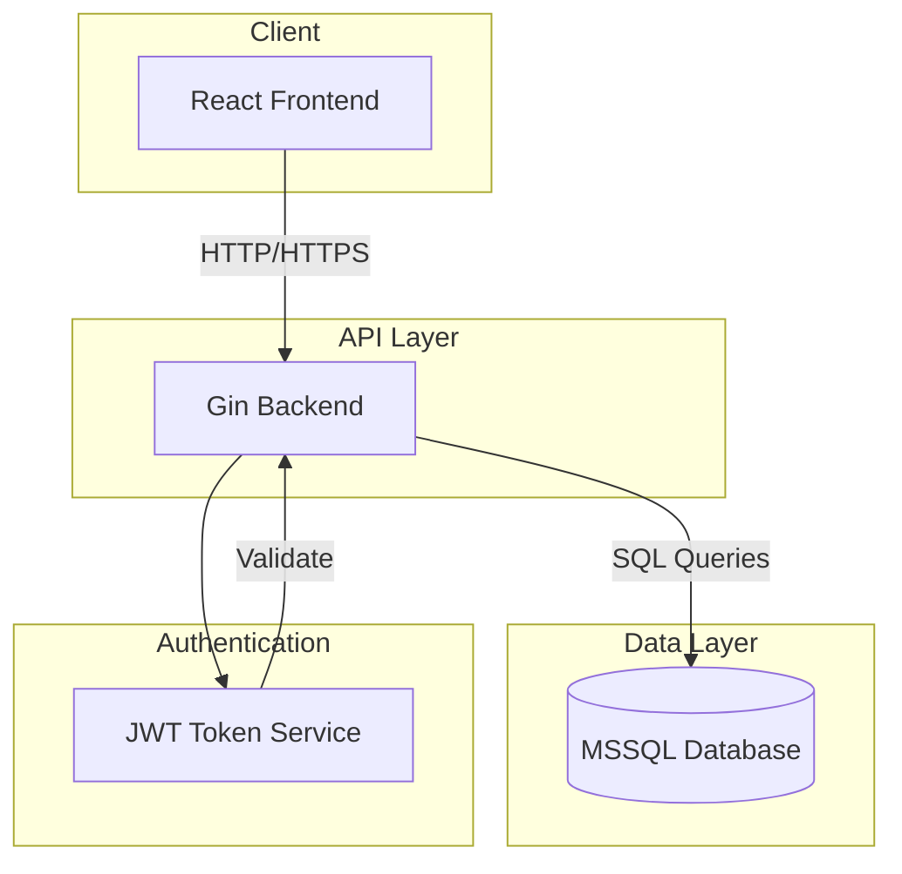
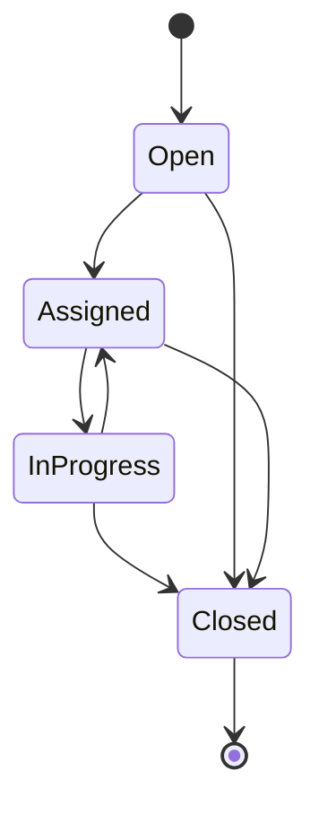
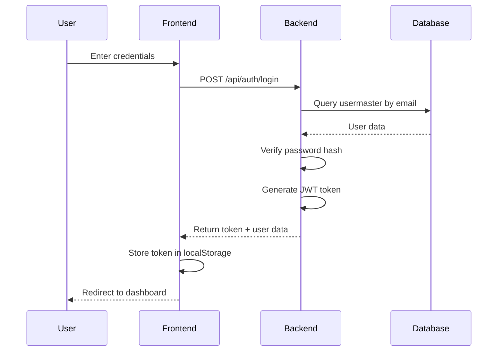
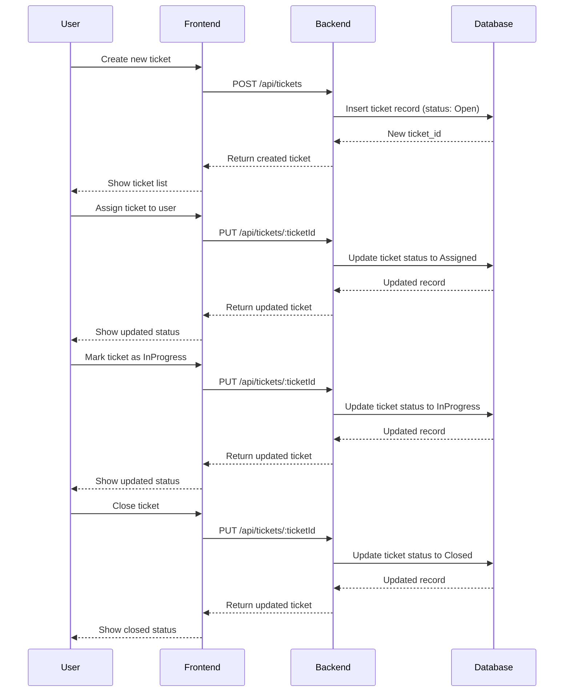

# Ticket Management System - Technical Design Document

## 1. System Overview

A full-stack ticket management system with user authentication, ticket creation, and status tracking capabilities.

### Technology Stack
- **Frontend**: React with TypeScript, Axios for API calls
- **Backend**: Go (Gin framework)
- **Database**: Microsoft SQL Server
- **Authentication**: JWT tokens

---

## 2. System Architecture



---

## 3. Database Schema

### 3.1 Usermaster Table

```sql
CREATE TABLE usermaster (
    user_id INT PRIMARY KEY IDENTITY(1,1),
    name VARCHAR(255) NOT NULL,
    company_name VARCHAR(255),
    emp_id VARCHAR(50),
    email VARCHAR(254) NOT NULL UNIQUE,
    password VARCHAR(255) NOT NULL,
    designation VARCHAR(100),
    report_to INT NULL,
    CreatedBy INT NULL,
    createdon DATETIME2 NOT NULL DEFAULT GETUTCDATE(),
    updatedBY INT NULL,
    UpdatedOn DATETIME2 NOT NULL DEFAULT GETUTCDATE(),
    traceid UNIQUEIDENTIFIER NOT NULL DEFAULT NEWID(),
    CONSTRAINT FK_usermaster_ReportTo FOREIGN KEY (report_to) REFERENCES usermaster(user_id),
    CONSTRAINT FK_usermaster_CreatedBy FOREIGN KEY (CreatedBy) REFERENCES usermaster(user_id),
    CONSTRAINT FK_usermaster_UpdatedBY FOREIGN KEY (updatedBY) REFERENCES usermaster(user_id)
);

CREATE INDEX IX_usermaster_email ON usermaster(email);
```

### 3.2 Tickets Table

```sql
CREATE TABLE tickets (
    ticket_id INT PRIMARY KEY IDENTITY(1,1),
    customer_name VARCHAR(255) NOT NULL,
    employee_name VARCHAR(255) NOT NULL,
    project_name VARCHAR(255) NOT NULL,
    ticket_type VARCHAR(50) NOT NULL,
    description TEXT,
    status VARCHAR(50) NOT NULL DEFAULT 'Open',
    created_at DATETIME2 NOT NULL DEFAULT GETUTCDATE(),
    updated_at DATETIME2 NOT NULL DEFAULT GETUTCDATE(),
    CreatedBy INT NULL,
    updatedBY INT NULL,
    traceid UNIQUEIDENTIFIER NOT NULL DEFAULT NEWID(),
    CONSTRAINT FK_tickets_CreatedBy FOREIGN KEY (CreatedBy) REFERENCES usermaster(user_id),
    CONSTRAINT FK_tickets_updatedBY FOREIGN KEY (updatedBY) REFERENCES usermaster(user_id)
);

CREATE INDEX IX_tickets_status ON tickets(status);
CREATE INDEX IX_tickets_CreatedBy ON tickets(CreatedBy);
```

### 3.3 Comments Table

```sql
CREATE TABLE comments (
    comment_id INT PRIMARY KEY IDENTITY(1,1),
    ticket_id INT NOT NULL,
    user_name VARCHAR(255) NOT NULL,
    message TEXT NOT NULL,
    created_at DATETIME2 NOT NULL DEFAULT GETUTCDATE(),
    CreatedBy INT NULL,
    updatedBY INT NULL,
    UpdatedOn DATETIME2 NOT NULL DEFAULT GETUTCDATE(),
    traceid UNIQUEIDENTIFIER NOT NULL DEFAULT NEWID(),
    CONSTRAINT FK_comments_ticket FOREIGN KEY (ticket_id) REFERENCES tickets(ticket_id) ON DELETE CASCADE,
    CONSTRAINT FK_comments_CreatedBy FOREIGN KEY (CreatedBy) REFERENCES usermaster(user_id),
    CONSTRAINT FK_comments_updatedBY FOREIGN KEY (updatedBY) REFERENCES usermaster(user_id)
);

CREATE INDEX IX_comments_ticket_id ON comments(ticket_id);
```

### 3.4 Attachments Table

```sql
CREATE TABLE attachments (
    attachment_id INT PRIMARY KEY IDENTITY(1,1),
    ticket_id INT NOT NULL,
    url VARCHAR(1000) NOT NULL,
    created_at DATETIME2 NOT NULL DEFAULT GETUTCDATE(),
    CreatedBy INT NULL,
    updatedBY INT NULL,
    UpdatedOn DATETIME2 NOT NULL DEFAULT GETUTCDATE(),
    traceid UNIQUEIDENTIFIER NOT NULL DEFAULT NEWID(),
    CONSTRAINT FK_attachments_ticket FOREIGN KEY (ticket_id) REFERENCES tickets(ticket_id) ON DELETE CASCADE,
    CONSTRAINT FK_attachments_CreatedBy FOREIGN KEY (CreatedBy) REFERENCES usermaster(user_id),
    CONSTRAINT FK_attachments_updatedBY FOREIGN KEY (updatedBY) REFERENCES usermaster(user_id)
);

CREATE INDEX IX_attachments_ticket_id ON attachments(ticket_id);
```

### 3.5 CommentAttachments Table

```sql
CREATE TABLE commentattachments (
    attachment_id INT PRIMARY KEY IDENTITY(1,1),
    comment_id INT NOT NULL,
    url VARCHAR(1000) NOT NULL,
    created_at DATETIME2 NOT NULL DEFAULT GETUTCDATE(),
    CreatedBy INT NULL,
    updatedBY INT NULL,
    UpdatedOn DATETIME2 NOT NULL DEFAULT GETUTCDATE(),
    traceid UNIQUEIDENTIFIER NOT NULL DEFAULT NEWID(),
    CONSTRAINT FK_commentattachments_comment FOREIGN KEY (comment_id) REFERENCES comments(comment_id) ON DELETE CASCADE,
    CONSTRAINT FK_commentattachments_CreatedBy FOREIGN KEY (CreatedBy) REFERENCES usermaster(user_id),
    CONSTRAINT FK_commentattachments_updatedBY FOREIGN KEY (updatedBY) REFERENCES usermaster(user_id)
);

CREATE INDEX IX_commentattachments_comment_id ON commentattachments(comment_id);
```

### 3.6 Status Workflow



**Status Enum Values:**
- `Open` - Initial ticket status
- `Assigned` - Ticket assigned to a user
- `InProgress` - Ticket being worked on
- `Closed` - Ticket resolved and closed

---

## 4. API Contracts

### 4.1 Authentication Endpoints

#### POST /api/auth/login
Request:
```json
{
    "email": "string",
    "password": "string"
}
```

Response:
```json
{
    "success": true,
    "data": {
        "token": "jwt_token_string",
        "expiresIn": 3600,
        "user": {
            "userId": 1,
            "name": "string",
            "email": "string",
            "designation": "string",
            "companyName": "string"
        }
    }
}
```

#### POST /api/auth/register
Request:
```json
{
    "name": "string",
    "email": "string",
    "password": "string",
    "company_name": "string",
    "designation": "string",
    "emp_id": "string"
}
```

Response:
```json
{
    "success": true,
    "data": {
        "userId": 1,
        "email": "string",
        "message": "Registration successful"
    }
}
```

#### POST /api/auth/refresh
Request: Header `Authorization: Bearer <refresh_token>`

Response:
```json
{
    "success": true,
    "data": {
        "token": "new_jwt_token",
        "expiresIn": 3600
    }
}
```

#### GET /api/auth/profile
Request Header: `Authorization: Bearer <token>`

Response:
```json
{
    "success": true,
    "data": {
        "userId": 1,
        "name": "string",
        "email": "string",
        "companyName": "string",
        "empId": "string",
        "designation": "string",
        "reportTo": null,
        "traceId": "uuid"
    }
}
```

### 4.2 Ticket Endpoints

#### POST /api/tickets
Request Header: `Authorization: Bearer <token>`

Request Body:
```json
{
    "customer_name": "string",
    "employee_name": "string",
    "project_name": "string",
    "ticket_type": "string",
    "description": "string"
}
```

Response:
```json
{
    "success": true,
    "data": {
        "ticketId": 1,
        "customerName": "string",
        "employeeName": "string",
        "projectName": "string",
        "ticketType": "string",
        "description": "string",
        "status": "Open",
        "createdAt": "2024-01-01T00:00:00Z",
        "traceId": "uuid"
    }
}
```

#### GET /api/tickets
Request Header: `Authorization: Bearer <token>`

Query Parameters:
- `page`: integer (default: 1)
- `pageSize`: integer (default: 10)
- `status`: string (optional filter: Open, Assigned, InProgress, Closed)
- `ticketType`: string (optional filter)
- `search`: string (optional search in customer_name, employee_name, project_name)
- `sortBy`: string (default: created_at)
- `sortOrder`: string (default: desc)

Response:
```json
{
    "success": true,
    "data": {
        "tickets": [
            {
                "ticketId": 1,
                "customerName": "string",
                "employeeName": "string",
                "projectName": "string",
                "ticketType": "string",
                "status": "Open",
                "createdAt": "2024-01-01T00:00:00Z",
                "traceId": "uuid"
            }
        ],
        "pagination": {
            "page": 1,
            "pageSize": 10,
            "totalItems": 50,
            "totalPages": 5
        }
    }
}
```

#### GET /api/tickets/:ticketId
Request Header: `Authorization: Bearer <token>`

Response:
```json
{
    "success": true,
    "data": {
        "ticketId": 1,
        "customerName": "string",
        "employeeName": "string",
        "projectName": "string",
        "ticketType": "string",
        "description": "string",
        "status": "Open",
        "createdAt": "2024-01-01T00:00:00Z",
        "updatedAt": "2024-01-01T00:00:00Z",
        "traceId": "uuid",
        "comments": [
            {
                "commentId": 1,
                "userName": "string",
                "message": "string",
                "createdAt": "2024-01-01T00:00:00Z",
                "traceId": "uuid"
            }
        ],
        "attachments": [
            {
                "attachmentId": 1,
                "url": "string",
                "createdAt": "2024-01-01T00:00:00Z"
            }
        ]
    }
}
```

#### PUT /api/tickets/:ticketId
Request Header: `Authorization: Bearer <token>`

Request Body:
```json
{
    "customer_name": "string",
    "employee_name": "string",
    "project_name": "string",
    "ticket_type": "string",
    "description": "string",
    "status": "Open|Assigned|InProgress|Closed"
}
```

Response: Same as GET /api/tickets/:ticketId

#### DELETE /api/tickets/:ticketId
Request Header: `Authorization: Bearer <token>`

Response:
```json
{
    "success": true,
    "message": "Ticket deleted successfully"
}
```

#### POST /api/tickets/:ticketId/attachments
Request Header: `Authorization: Bearer <token>`

Request Body:
```json
{
    "url": "string"
}
```

Response:
```json
{
    "success": true,
    "data": {
        "attachmentId": 1,
        "ticketId": 1,
        "url": "string",
        "createdAt": "2024-01-01T00:00:00Z"
    }
}
```

#### POST /api/tickets/:ticketId/comments
Request Header: `Authorization: Bearer <token>`

Request Body:
```json
{
    "userName": "string",
    "message": "string"
}
```

Response:
```json
{
    "success": true,
    "data": {
        "commentId": 1,
        "ticketId": 1,
        "userName": "string",
        "message": "string",
        "createdAt": "2024-01-01T00:00:00Z",
        "traceId": "uuid"
    }
}
```

#### POST /api/comments/:commentId/attachments
Request Header: `Authorization: Bearer <token>`

Request Body:
```json
{
    "url": "string"
}
```

Response:
```json
{
    "success": true,
    "data": {
        "attachmentId": 1,
        "commentId": 1,
        "url": "string",
        "createdAt": "2024-01-01T00:00:00Z"
    }
}
```

---

## 5. Frontend Component Structure

```
src/
├── components/
│   ├── common/
│   │   ├── Button/
│   │   │   ├── Button.tsx
│   │   │   ├── Button.module.css
│   │   │   └── index.ts
│   │   ├── Input/
│   │   │   ├── Input.tsx
│   │   │   ├── Input.module.css
│   │   │   └── index.ts
│   │   ├── Modal/
│   │   │   ├── Modal.tsx
│   │   │   ├── Modal.module.css
│   │   │   └── index.ts
│   │   ├── Table/
│   │   │   ├── Table.tsx
│   │   │   ├── Table.module.css
│   │   │   └── index.ts
│   │   ├── StatusBadge/
│   │   │   ├── StatusBadge.tsx
│   │   │   ├── StatusBadge.module.css
│   │   │   └── index.ts
│   │   └── FileUpload/
│   │       ├── FileUpload.tsx
│   │       ├── FileUpload.module.css
│   │       └── index.ts
│   ├── layout/
│   │   ├── Header/
│   │   │   ├── Header.tsx
│   │   │   ├── Header.module.css
│   │   │   └── index.ts
│   │   ├── Sidebar/
│   │   │   ├── Sidebar.tsx
│   │   │   ├── Sidebar.module.css
│   │   │   └── index.ts
│   │   └── Layout/
│   │       ├── Layout.tsx
│   │       └── index.ts
│   └── tickets/
│       ├── TicketCard/
│       │   ├── TicketCard.tsx
│       │   ├── TicketCard.module.css
│       │   └── index.ts
│       ├── TicketForm/
│       │   ├── TicketForm.tsx
│       │   ├── TicketForm.module.css
│       │   └── index.ts
│       ├── TicketList/
│       │   ├── TicketList.tsx
│       │   ├── TicketList.module.css
│       │   └── index.ts
│       ├── TicketDetail/
│       │   ├── TicketDetail.tsx
│       │   ├── TicketDetail.module.css
│       │   └── index.ts
│       ├── Comment/
│       │   ├── Comment.tsx
│       │   ├── Comment.module.css
│       │   └── index.ts
│       └── CommentAttachments/
│           ├── CommentAttachments.tsx
│           └── index.ts
├── pages/
│   ├── Login/
│   │   ├── Login.tsx
│   │   ├── Login.module.css
│   │   └── index.ts
│   ├── Register/
│   │   ├── Register.tsx
│   │   ├── Register.module.css
│   │   └── index.ts
│   ├── Dashboard/
│   │   ├── Dashboard.tsx
│   │   ├── Dashboard.module.css
│   │   └── index.ts
│   ├── Tickets/
│   │   ├── Tickets.tsx
│   │   ├── Tickets.module.css
│   │   └── index.ts
│   └── TicketDetailPage/
│       ├── TicketDetailPage.tsx
│       └── index.ts
├── hooks/
│   ├── useAuth.ts
│   ├── useTickets.ts
│   ├── useComments.ts
│   └── useAttachments.ts
├── services/
│   ├── api.ts
│   ├── auth.ts
│   ├── tickets.ts
│   ├── comments.ts
│   └── attachments.ts
├── store/
│   ├── authSlice.ts
│   ├── ticketsSlice.ts
│   └── uiSlice.ts
├── types/
│   ├── user.ts
│   ├── ticket.ts
│   ├── comment.ts
│   └── attachment.ts
├── utils/
│   ├── constants.ts
│   ├── validators.ts
│   └── statusMapping.ts
├── App.tsx
├── main.tsx
└── index.css
```

---

## 6. Authentication Flow



---

## 7. Ticket Status Flow



---

## 8. Security Considerations

1. **Password Hashing**: Use bcrypt for password hashing
2. **JWT Tokens**: 
   - Access token expires in 1 hour
   - Refresh token expires in 7 days
   - Tokens stored in httpOnly cookies for production
3. **Input Validation**: Validate all inputs on both frontend and backend
4. **SQL Injection Prevention**: Use parameterized queries
5. **CORS**: Configure allowed origins
6. **Rate Limiting**: Implement rate limiting on auth endpoints
7. **Trace ID**: Each record includes a unique traceid for audit tracking

---

## 9. Error Handling

### Standard Error Response Format
```json
{
    "success": false,
    "error": {
        "code": "ERROR_CODE",
        "message": "Human readable message",
        "details": {}
    }
}
```

### Error Codes
- `AUTH_INVALID_CREDENTIALS`: Invalid email or password
- `AUTH_TOKEN_EXPIRED`: JWT token has expired
- `AUTH_INVALID_TOKEN`: JWT token is invalid
- `TICKET_NOT_FOUND`: Ticket does not exist
- `TICKET_ACCESS_DENIED`: User cannot access this ticket
- `VALIDATION_ERROR`: Input validation failed
- `DATABASE_ERROR`: Database operation failed
- `FILE_UPLOAD_FAILED`: File upload operation failed

---

## 10. Implementation Phases

### Phase 1: Database Setup
- Create database schema with all 5 tables
- Set up indexes on status, email, ticket_id
- Create stored procedures for common operations
- Add traceid generation logic

### Phase 2: Backend API
- Set up Gin server
- Implement authentication endpoints
- Implement ticket CRUD endpoints
- Implement comment endpoints
- Implement attachment endpoints
- Add error handling and validation

### Phase 3: Frontend
- Set up React project with TypeScript
- Implement authentication pages
- Implement ticket listing and detail pages
- Implement ticket creation and editing forms
- Implement file upload for attachments
- Add state management with Redux or Context API

### Phase 4: Integration & Testing
- Connect frontend to backend
- Test all user flows
- Perform security testing
- Optimize performance

---

## 11. Next Steps

1. Review and approve this design
2. Create database migration scripts
3. Set up backend project structure
4. Set up frontend project structure
5. Begin implementation
